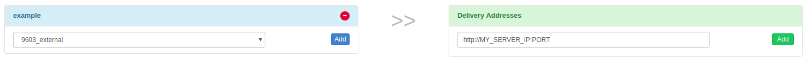

# SatComInfrastructure
Long range communication utility software for data relay and handling.

This repository provides the tools to setup a long range communication links using SatCom and/or an LTE link.
The latency using the SatCom link is expected to be on average around 10-15 seconds given good signal strength but can exceed a minute with bad connection.
The latency of the LTE link also depends on the signal strengths but from experience is well below 0.1 seconds.

The SatCom system is based on the [Rock7 RockBLOCK](http://www.rock7mobile.com/products-rockblock) Iridium modem.

Tested on Ubuntu 14.04, 16.04, and 18.04. Not tested and supported on Windows.

## Architecture Overview

The following components are required for an operating satellite communication link:
* A Pixhawk flashed with the PX4 Autopilot Release 1.8 or later.
* A [RockBlock 9603](http://www.rock7mobile.com/products-rockblock-9603) module connected to the Pixhawk (SatCom link).
* An onboard computer connected to the Pixhawk and a LTE stick with an activated SIM card (LTE link).
* A message relay server running Ubuntu.
* A ground station computer with QGroundControl installed and running Ubuntu 14.04, 16.04, 18.04 as the operating system.

The SatCom link running cost consists of a line rental and per message cost:
* Each module needs to be activated which costs £10.00 per month
* Each message transmitted over the system costs one Credit per 50 bytes. Bundles of Credits can be bought from RockBlock for £0.04-£0.11 per Credit depending on the bundle size.

The cost of the LTE link depends on the data plan.

The full system architecture is shown below:


The software consists of the following modules:

* `mosquitto` - Message broker running on the relay server, taking care of queueing and distributing the messages to other components ([link](https://mosquitto.org/))
* `relay.py` - Python script running on the relay server providing the Rock7 HTTP POST and MQTT interfaces. It additionally also offers an UDP interface.
* `udp2mqtt.py` - Python script running on the ground station computer together with QGC. Connects to the MQTT broker running on the relay server and retransmits the messages from/to QGC using a local UDP socket.
* `simulator.py` - Python script used for development and testing of the relay system. Replaces the actual Iridium hardware by simulating the Iridium 9602/9603 modem UART interface and the Rock7 HTTP POST interface.
* `proxy` - Relays the mavlink messages on the onboard computer over UDP, for example [mavros](http://wiki.ros.org/mavros) or [mavproxy](http://ardupilot.github.io/MAVProxy/html/index.html)
* `QGroundControl` - Software to receive and send messages from/to the autopilot

The SatCom link can be simulated to test and evaluate the ground station computer and autopilot logic:


## Vehicle Setup
### Wiring
Connect the RockBlock module to a serial port of the Pixhawk. Due to the power requirements of the module it can only be powered over a high-power serial port as a maximum of 0.5 A at 5 V are required. If none is available/free then another power source which has the same ground level as the Pixhawk and can provide required power has to be setup. The details of the [connectors](https://docs.rockblock.rock7.com/docs/connectors) and the [power requirements](https://docs.rockblock.rock7.com/docs/power-supply) can be found in the RockBlock documentation.

### Module
The module can either use the internal antenna or an external one connected to the SMA connector. To [switch between the two antennas modes](https://docs.rockblock.rock7.com/docs/switching-rockblock-9603-antenna-mode) the position of a small RF link cable needs to changed. If an external antenna is used always make sure that the antenna is connected to the module before powering it up to avoid damage to the module.

The default baud rate of the module is 19200. However, the iridiumsbd driver of the PX4 Autopilot requires a baud rate of 115200 so it needs to be changed using the [AT commands](http://www.rock7mobile.com/downloads/IRDM_ISU_ATCommandReferenceMAN0009_Rev2.0_ATCOMM_Oct2012.pdf).

1. Connect to the module with using a 19200/8-N-1 setting and check if the communication is working using the command: `AT`. The response should be: `OK`.
2. Change the baud rate:

    `AT+IPR=9`

3. Reconnect to the model now with a 115200/8-N-1 setting and save the configuration using

    `AT&W0`

Now the module is ready to be used together with the PX4 autopilot.

### Software
Flash the Pixhawk with the PX4 release 1.8 or newer. To activate either set the `SYS_COMPANION` parameter to `Iridium Telemetry (115200 baud, 8N1)` or add the following lines to the `extras.txt` on the SD card:

```
	# add a sleep here to make sure that the module is powered
	usleep 200000

	#driver
	if iridiumsbd start -d SERIAL_PORT
	then
		# start the iridium mavlink instance
		mavlink start -d /dev/iridium -m iridium -b 115200

		# Sleep a bit to give Mavlink time to set up
		usleep 100000

	else
		echo "WARN: Iridiumsbd driver not started, reboot"
		tune_control play -m "ML<<CP4CP4CP4CP4CP4"
	fi
```

where `SERIAL_PORT` is the serial port to which the RockBlock module is connected.

## RockBlock Setup
When buying the first module on RockBlock an user account needs to be created in a first step. Log in to the [account](https://rockblock.rock7.com/Operations) and register the RockBlock module under the `My RockBLOCKs`. Activate the line rental for the module and make sure that enough Credits for the expected flight duration are available on the account. When using the default settings one message per minute is sent from the airplane to the ground station.

Set up a delivery group for the message relay server and add the module to that delivery group:



## Relay Server Setup
It is expected that the relay server is either using the Ubuntu 16.04 or 18.04 OS. 

* The server working as a message relay must have a static IP address and two publicly accessible, open TCP ports:
	* `1883` for the Mosquitto message broker (could be configured)
	* `45679` for the HTTP POST interface (can be changed in `relay.cfg`)

* One additional open UDP port is required for the LTE link:
    * `30000` for receiving messages (can be configured in `relay.cfg`)

* Install the required python modules

    `pip install tornado==5.1.1 future paho-mqtt`

* Install the `mosquitto` message broker

    `sudo apt-get install mosquitto`

* Configure the [broker's credentials](https://www.vultr.com/docs/how-to-install-mosquitto-mqtt-broker-server-on-ubuntu-16-04):

    `sudo mosquitto_passwd -c /etc/mosquitto/passwd USER` -> `Password: PASSWORD`

    `sudo nano /etc/mosquitto/conf.d/default.conf` with

```
allow_anonymous false
password_file /etc/mosquitto/passwd
```

* Install tmux:

    `sudo apt-get install tmux`

* Clone the SatComInfrastructure repository:

    `git clone https://github.com/acfloria/SatComInfrastructure.git`

* Edit the `relay.cfg` configuration file to reflect your settings.

* Add a `credentials.cfg` configuration file to reflect your settings with the following structure:

```
[mqtt]

# username and password for the mqtt broker (mosquitto)
user = MQTT_USER
password = MQTT_PASSWORD

[rockblock]

# IMEI of the destination RockBLOCK modem
imei = MODULE_IMEI

# Rock7 username
username = ROCK7_USERNAME

# Rock7 password
password = ROCK7_PASSWORD
```

* Start the relay script in the detached mode using screen or [tmux](https://linuxize.com/post/getting-started-with-tmux/):
	
	`screen -dm bash -c 'cd SatcomInfrastructure/; ./relay.py`

## Ground Station Computer Setup


### QGC computer setup

* Install the required python modules

    `pip install tornado==5.1.1 future paho-mqtt`

* Clone the SatComInfrastructure repository:

    `git clone https://github.com/acfloria/SatComInfrastructure.git`

* Edit the `udp2mqtt.cfg` configuration file to reflect your settings.

* [Install](https://docs.qgroundcontrol.com/en/getting_started/download_and_install.html) the latest dayly build of QGroundControl.

* Add a UDP connection in QGC with the parameters for the SatCom link:

    * `Listening port: 10000`
    * `Target hosts: 127.0.0.1:10001`
    * `High Latency: Checked`

* Add a UDP connection in QGC with the parameters for the LTE link:

    * `Listening port: 20000`
    * `Target hosts: 127.0.0.1:20001`
    * `High Latency: Not checked`


#### Verification
1. Open a terminal on the ground station computer and change to the location of the SatComInfrastructure repository. Then start the `udp2rabbit.py` script:
    
    `./udp2mqtt.py`

2. Send a test message from [RockBlock Account](https://rockblock.rock7.com/Operations) to the created delivery group in the `Test Delivery Groups` tab.

If in the terminal where the `udp2mqtt.py` script is running within a couple of seconds the acknowledge for a message can be observed, then the RockBlock delivery group, the relay server and the udp2rabbit script are set up correctly:


## Running the System
1. Start QGroundControl. Manually connect first the high latency link, the LTE link, and then the regular telemetry link:


2. Open a terminal on the ground station computer and change to the location of the SatComInfrastructure repository. Then start the `udp2mqtt.py` script:

    `./udp2mqtt.py`

3. Power up the vehicle.

4. Wait until the first `HIGH_LATENCY2` message is received on QGC. This can be checked either using the `MavLink Inspector` widget or on the toolbar with the `LinkIndicator`. If more than one link is connected to the active vehicle the `LinkIndicator` shows all of them by clicking on the name of the shown link:


The link indicator always shows the name of the priority link.

5. The satellite communication system is now ready to use. The priority link, which is the link over which commands are send, is determined the following ways:
    * If no link is commanded by the user a regular radio telemetry link is preferred over the high latency link.
    * The autopilot and QGC will fall back from the regular radio telemetry to the high latency link if the vehicle is armed and the radio telemetry link is lost (no mavlink messages received for a certain time). As soon as the radio telemetry link is regained QGC and the autopilot will switch back to it.
    * The user can select a priority link over the `LinkIndicator` on the toolbar. This link is kept as the priority link as long as this link is active or the user selects another priority link:


## Troubleshooting
* Satellite communication messages from the airplane are received but no commands can be transmitted (the vehicle does not react)

    * Check the settings of the relay server and make sure that they are correct, especially the imei.
 
* No satellite communication messages from the airplane arrive on the ground station:
    
    * Check using the system console if the iridiumsbd driver started and if it did that a signal from any satellite is received by the module:

        * `iridiumsbd status`

    * Make sure using the verification steps from above that the relay server, the delivery group and the `udp2mqtt.py` script are set up correctly.
    
    * Check if the link is connected and that its settings are correct.

* The IridiumSBD driver does not start:

    * Reboot the vehicle. If that helps increase the sleep time in the `extras.txt` before the driver is started. If that does not help make sure that the Pixhawk and the module have the same ground level. Confirm also that the baudrate of the module is set to 115200.

* A first message is received on the ground but as soon as the vehicle is flying no message can be transmitted or the latency is significantly larger (in the order of minutes)

    * Check the signal quality after the flight. If it is decreasing during the flight and you are using the internal antenna consider using an external antenna. If you are already using the external antenna try moving the antenna as far away as possible from any electronics or anything which might disturb the signal. Also make sure that the antenna is is not damaged.

## TODOs

* Integrate the MQTT interface into QGC, eliminating the need of the `udp2mqtt.py` script.
