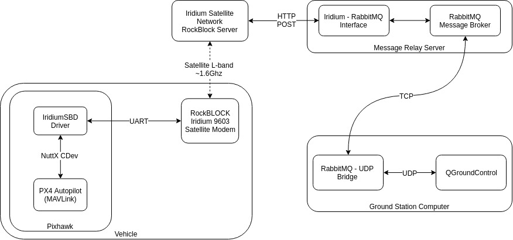
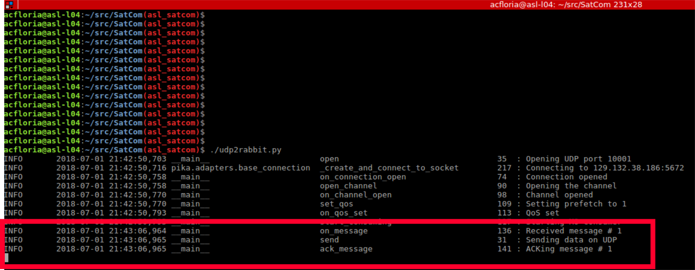
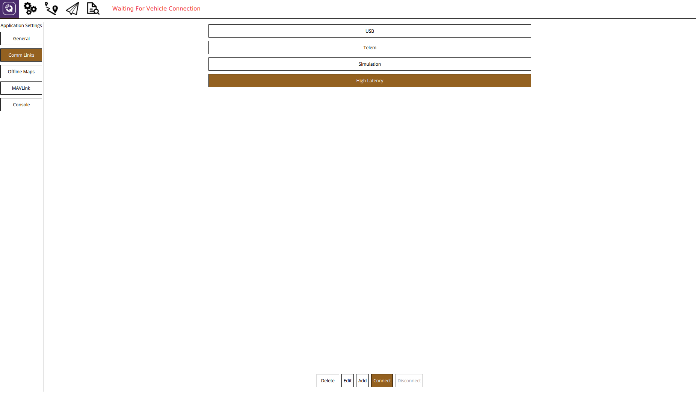
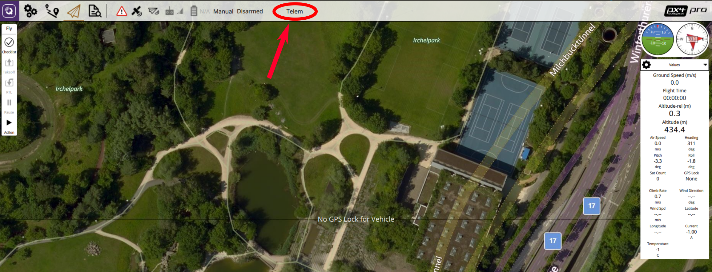
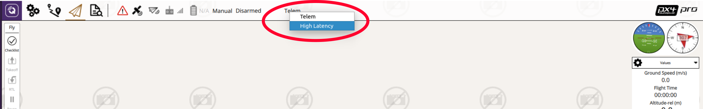

# Satellite Communication System Manual
The satellite communication system ensures a long range high latency link between the ground station and the vehicle using RockBlock as the service provider for the Iridium SBD Satellite Communication System. Given good signal quality the latency is between 10 to 20 seconds.

 The link running cost consist of a line rental and per message cost:
* Each module needs to be activated which costs £10.00 per month
* Each message transmitted over the system costs one Credit per 50 bytes. Bundles of Credits can be bought from RockBlock for £0.04-£0.11 per Credit depending on the bundle size.

The following components are required for an operating satellite commuication link:
* A [RockBlock 9603](http://www.rock7mobile.com/products-rockblock-9603) module connected to a Pixhawk flashed with the PX4 Autopilot.
* A message relay server running Ubuntu.
* A groundStation computer with QGroundControl installed and running Ubuntu as the operating system.

Notes: 
* It might be possible to run the system also using Windows as OS but this is not supported and has not been tested yet.
* The [RockBlock MK2](http://www.rock7mobile.com/products-rockblock) can also be used but the RockBlock 9603 module is recommended as it is smaller and lighter.
* Refer to the [RockBlock Documentation](https://docs.rockblock.rock7.com/docs) for a detailed explanation of the modules, running costs and RockBlock in general.

In the following figure the full system architecture is shown:



## Set-up

In this section the set-up of the individual system components is described.

#### Vehicle
###### Wiring
Connect the RockBlock module to a serial port of the Pixhawk. Due to the power requirements of the module it cannot be powered over a serial port. Another power source which has the same ground level as the Pixhawk and can provide 0.5 A at 5 V is required. The details of the [connectors](https://docs.rockblock.rock7.com/docs/connectors) and the [power requirements](https://docs.rockblock.rock7.com/docs/power-supply) can be found in the RockBlock documentation.
If an external antenna is used always make sure that the antenna is connected to the module before powering it up.

###### Software
Flash the Pixhawk with the latest PX4 master or the release after v.1.8, which has not been release at the time this manual was written.

Add the following lines to the `extras.txt` on the SD card:


```
	# add a sleep here to make sure that the module is powered
	usleep 500000

	#driver
	iridiumsbd start -d SERIAL_PORT

	# sleep to make sure that the driver is started
	usleep 100000

	mavlink start -d /dev/iridium -m iridium -b 115200

	# Sleep a bit to give Mavlink time to set up
	usleep 100000

```
Where `SERIAL_PORT` is the serial port to which the RockBlock module is connected.

#### RockBlock
When buying the first module on RockBlock an user account needs to be created in a first step. Log in to the [account](https://rockblock.rock7.com/Operations) and register the RockBlock module under the `My RockBLOCKs`. Activate the line rental for the module and make sure that enough Credits for the expected flight duration are available on the account. When using the default settings one message per minute is sent from the airplane to the ground station.

Set up a delivery group for the message relay server and add the module to that delivery group:


#### Relay Server
It is expected that the relay server is either using the Ubuntu 16.04 or 14.04 OS. 
* The server working as a message relay should have a static IP address and two publicly accessible, open TCP ports:

    *  `5672` for the RabbitMQ message broker (can be changed in the rabbitmq settings)
    * `45679` for the HTTP POST interface (can be changed in the `relay.cfg` file)

* Install the required python modules:

    `sudo pip install pika`
    `sudo pip install tornado`
    `sudo pip install future`

* Install the `rabbitmq` message broker:

    `sudo apt install rabbitmq-server`

* Configure the broker's credentials (change PWD to your preferred password):

    `sudo rabbitmqctl add_user iridiumsbd PWD`
    `sudo rabbitmqctl set_permissions iridiumsbd ".*" ".*" ".*"`

* Clone the SatComInfrastructure repository:

    `git clone https://github.com/acfloria/SatComInfrastructure.git`

* Go to the location of the SatComInfrastructure repo and configure the broker's queues:

    `./setup_rabbit.py localhost iridiumsbd PWD`

* Verify the setup:

    `sudo rabbitmqctl list_queues`

    This should give you a list of 4 queues: `MO`, `MO_LOG`, `MT`, `MT_LOG`

* Edit the `relay.cfg` configuration file to reflect your settings.

* Start the relay script in the detached mode:
	
	`screen -dm bash -c 'cd SatcomInfrastructure/; ./relay.py`

* In order to detach from the screen use:

	`ctrl+a d`

* To kill the execution of the script use:

	`ctrl+a :quit`

* To reattach to the screen type:

	`screen -dr`

#### Ground Station Computer
* Install the required python modules:

    `sudo pip install pika`
    `sudo pip install tornado`
    `sudo pip install future`
    
* Clone the SatComInfrastructure repository:

    `git clone https://github.com/acfloria/SatComInfrastructure.git`

* Edit the `udp2rabbit.cfg` configuration file to reflect your settings.

* [Install](https://docs.qgroundcontrol.com/en/getting_started/download_and_install.html) QGroundControl. Use either the latest dayly build or the 3.4 release (which has not been released yet at the time this manual was written)

* Add a UDP connection in QGC with the parameters:

    * Listening port: 10000
    * Target hosts: 127.0.0.1:10001
    * High Latency: checked


#### Verification
1. Open a terminal on the ground station computer and change to the location of the SatComInfrastructure repository. Then start the `udp2rabbit.py` script:
    
    `./udp2rabbit.py`

2. Send a test message from [RockBlock Account](https://rockblock.rock7.com/Operations) to the created delivery group in the `Test Delivery Groups` tab.

If in the terminal where the `udp2rabbit.py` script is running within a couple of seconds the acknowledge for a message can be observed, then the RockBlock delivery group, the relay server and the udp2rabbit script are set up correctly:




## Operating the System
1. Open a terminal on the ground station computer and change to the location of the SatComInfrastructure repository. Then start the `udp2rabbit.py` script:
    
    `./udp2rabbit.py`

2. Start QGroundControl. Manually connect first the high latency link, then the regular telemetry link:



3. Power up the vehicle.

4. Wait until the first `HIGH_LATENCY2` message is received on QGC. This can be checked either using the `MavLink Inspector` widget or on the toolbar. All active links are displayed when clicking on the name of the priority link on the toolbar:



5. The satellite communication system is now ready to use. The priority link, which is the link over which commands are send, is determined the following ways:
    * If no link is commanded by the user a regular radio telemetry link is preferred over the high latency link.
    * The autopilot and QGC will fall back from the regular radio telemetry to the high latency link if the vehicle is armed and the radio telemetry link is lost (no mavlink messages received for a certain time). As soon as the radio telemetry link is regained QGC and the autopilot will switch back to it.
    * The user can select a priority link over the toolbar. This link kept as the priority link as long as this link is active or the user selects another priority link:



## Troubleshooting
* Satellite communication messages from the airplane are received but no commands can be transmitted (the vehicle does not react)

    * Check the settings of the relay server and make sure that they are correct, especially the imei.
 
* No satellite communication messages from the airplane arrive on the ground station:
    
    * Check using the system console if the iridiumsbd driver started and if it did that a signal from any satellite is received by the module:

        * `iridiumsbd status`

    * Make sure using the verification steps from above that the relay server, the delivery group and the `udp2rabbit.py` script are set up correctly.
    
    * Check if the link is connected and that its settings are correct.

* The IridiumSBD driver does not start:

    * Reboot the vehicle. If that helps increase the sleep time in the `extras.txt` before the driver is started. If that does not help make sure that the Pixhawk and the module have the same ground level.

* A first message is received on the ground but as soon as the vehicle is flying no message can be transmitted or the latency is significantly larger (in the order of minutes)

    * Check the signal quality after the flight. If it is decreasing during the flight and you are using the internal antenna consider using an external antenna. If you are already using the external antenna try moving the antenna as far away as possible from any electronics or anything which might disturb the signal.

